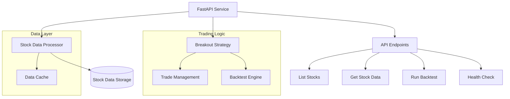
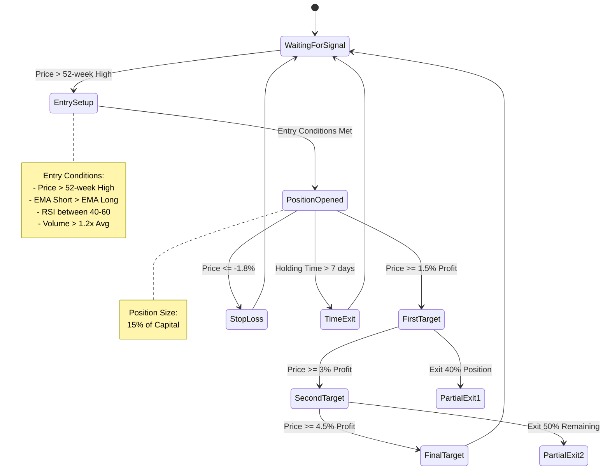
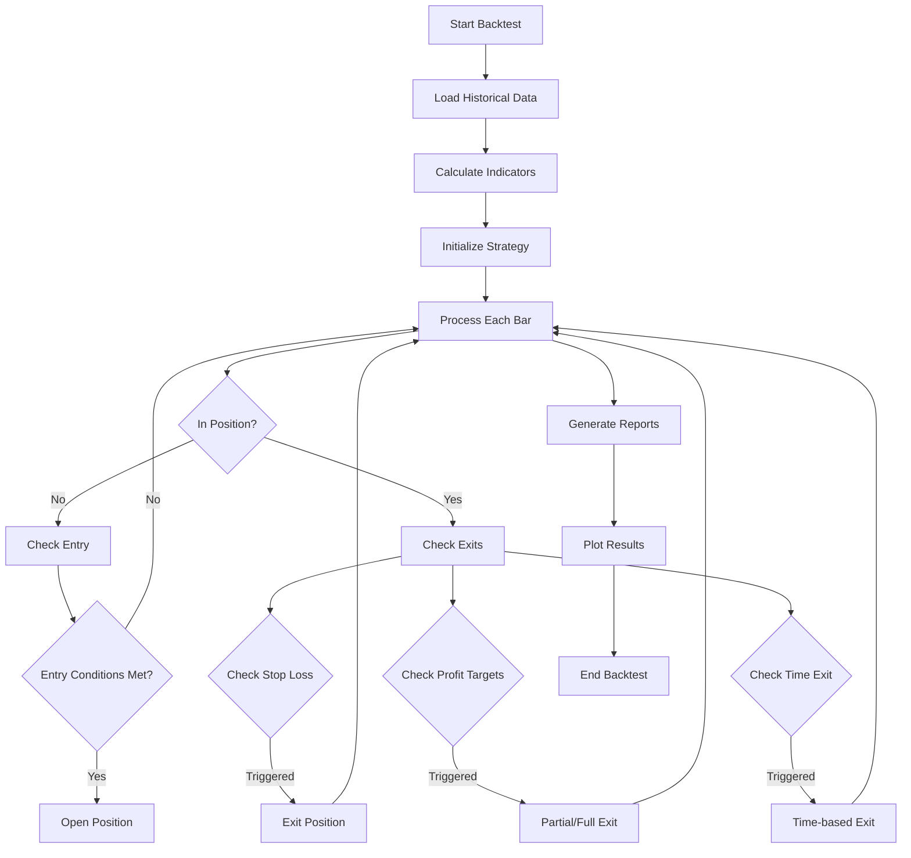

# Trading System Documentation

### Overview
This is a trading system implemented in Python that combines a FastAPI web service with a breakout trading strategy. 
The system includes data processing, backtesting capabilities, and performance reporting.

### System Architecture
The system is composed of several key components working together


### Key Components:

- FastAPI Service: Main web service handling HTTP requests
- Stock Data Processor: Manages data loading and processing
- Data Cache: In-memory storage for quick data access
- Breakout Strategy: Implements the trading logic
- Trade Management: Handles position tracking and management
- Backtest Engine: Simulates strategy performance

### Trading Strategy
The implemented strategy is a breakout system with multiple profit targets and risk management rules.



### Strategy Parameters:

### Entry Conditions:

- Price breaks above 52-week high
- Short EMA (10) above Long EMA (21)
- RSI between 40-60 (neutral zone)
- Volume > 1.2x average volume


### Risk Management:

- Position Size: 15% of capital
- Stop Loss: -1.8% from entry
- Maximum Holding Period: 7 days

### Profit Targets:

- First Target (1.5%): Exit 40% of position
- Second Target (3.0%): Exit 50% of remaining
- Final Target (4.5%): Exit remaining position

### Backtesting Process
The system includes a comprehensive backtesting engine for strategy validation.



### Backtest Features:

### Data Processing:

- Historical data loading
- Indicator calculation
- Price and volume analysis

### Trade Simulation:

- Position sizing
- Entry/exit execution
- Partial position management
- Multiple exit types (profit target, stop loss, time)

### Performance Analysis:

- Trade statistics
- Equity curve generation
- Risk metrics calculation
- Visual performance charts

### Reporting Capabilities:

- Trade-by-trade analysis
- Profit/Loss metrics
- Win rate calculation
- Holding period statistics
- Risk-adjusted returns
- Equity curve visualization

### API Endpoints
Main Endpoints:

```shell
/stocks

# Lists available stocks
# Returns total count and symbols


/stocks/{symbol}

# Retrieves historical data for specific symbol
# Supports date range filtering


/backtest/{symbol}

# Runs strategy backtest
# Returns comprehensive performance report
# Generates strategy and balance plots


/health

# System health check
# Cache status monitoring
```


### Trade Management
The system implements a Trade class for managing individual positions:

**Trade Features:**

* Entry/exit price tracking
* Position sizing
* Partial exit handling
* P&L calculation
* Holding period tracking

**Risk Management Features:**

* Dynamic position sizing
* Stop loss management
* Multiple profit targets
* Time-based exit rules

**Performance Visualization**
The system generates two types of plots:

Strategy Performance Plot:

Price action with EMAs
Entry/exit signals
Profit targets
Stop levels


Balance Chart:

Equity curve
Drawdown analysis
Return metrics
Risk statistics


This trading system represents a comprehensive solution for automated trading strategy implementation and testing, with robust risk management and performance analysis capabilities.